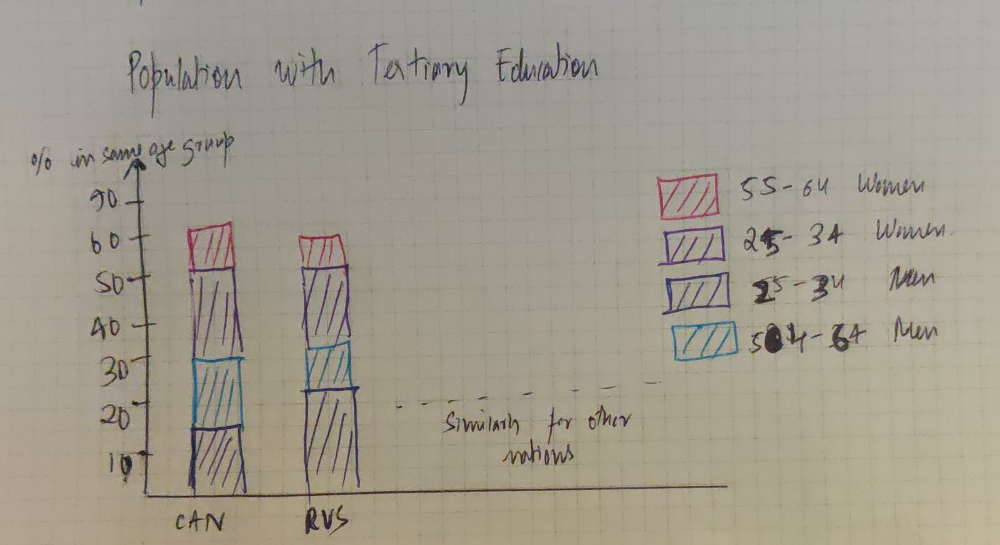
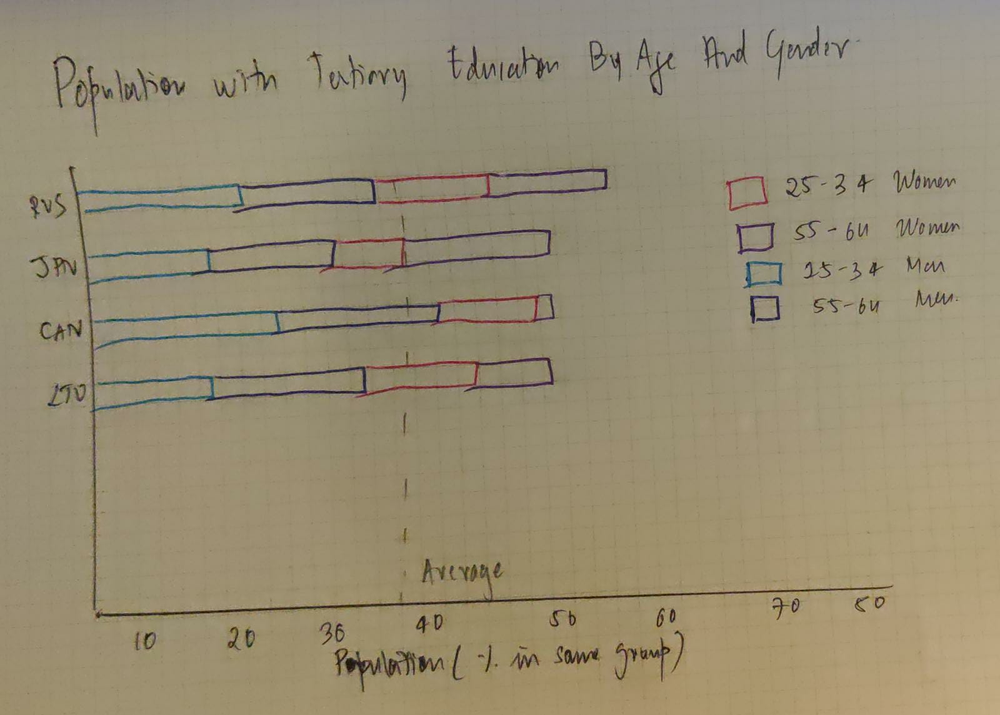
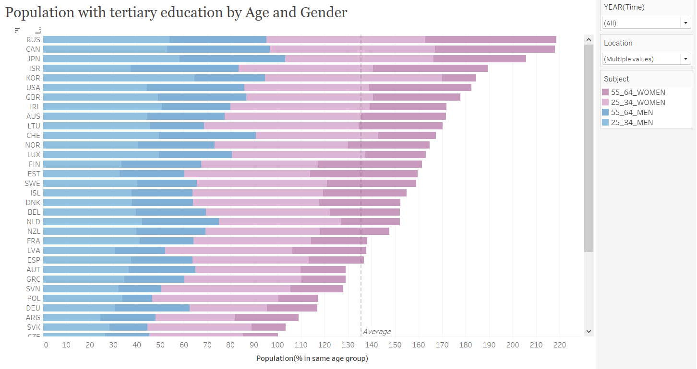

# 1 : Chosen Data Visualization
Article: [Population with tertiary education](https://data.oecd.org/eduatt/population-with-tertiary-education.htm)

**Background:**
Population with tertiary education is defined as those having completed the highest level of education, by age group. This includes both theoretical programmes leading to advanced research or high skill professions such as medicine and more vocational programmes leading to the labour market. The measure is percentage of same age population, also available by gender. As globalisation and technology continue to re-shape the needs of labour markets worldwide, the demand for individuals with a broader knowledge base and more specialised skills continues to rise. This visualization represents the population with tertiary education distribution by age and gender across OECD countries and I choose this as I liked the topic and saw areas of improvement 

# 2 : Critique

## 1. Describe your overall observations about the data visualization here. What stood out to you? What did you find worked really well? What didn't? What, if anything, would you do differently?

**Things that stood out:**  
- The **Blue bubbles** representing 25-34 year-olds
- The **Chart Title** definitely stood out to me. I felt it's clear and crisp

**What I liked:**   
- Apt use of **typography:** I like how neatly the countries are represented in x-axis, as it can get easily get clumpy to represent 37 countries together 

**What I disliked:**   
- **Look and Design of Data points**: The mix of solid and non solid data points is quite confusing, and also there is overlap of these data points
- **Overuse and Incorrect color** is distracting readers and the OECD average in black is getting lost in between all the blues
- **The Y-Axis**: Not sure what that number represents, had to look deeply to figure that it is % in same age group

**What I would change:**   
- I would sort the countries in descending order of population with tertiary education 
- **Intuitive color scheme** in the chart to draw attention to each group - age and gender
- Maybe change the **chart type** and use a bar chart to represent the same information

## 2. Who is the primary audience for this tool? Do you think this visualization is effective for reaching that audience? Why or why not?

According to me, the primary audience for this visualization is the **readers of OECD website and government officials**.
I have used Few, Stephen. “Data Visualization Effectiveness Profile,” 2017 http://www.perceptualedge.com/articles/visual_business_intelligence/data_visualization_effectiveness_profile.pdf to measure effectiveness of this graph

## 3. Final thoughts: how successful was this method at evaluating the data visualization you selected? Are there measures you feel are missing or not being captured here? What would you change? Provide 1-2 recommendations (color, type of visualization, layout, etc.)

I felt this critiquing method was very effective in evaluating the data visualization. While this method allows us to gauge the effectiveness of a chart using 7 different criteria, the Good Charts method allows us to be more specific about what we like and dislike in terms of color, typography, etc.  This one is definitely requires much detailed analysis than Good Charts, but I feel but can do the trick in their own way

Measures I felt missing are Aesthetics and Perceptibility. My recommendations:
1. Type of graph -- Could use a stacked bar chart for representating distribution of different groups in each country
2. Labeling -- Mention % in same age group in the y-axis label to improve perceptibility

# 3 : Wireframes and Feedback

## First Trial

### Feedback received:

**Friend 1:**   
- "The link between the title of the article and the visualization is not clear"
- Maybe change the bar alignment from vertical to horizontal to feel a smooth decreasing flow from country to country

**Friend 2:**   
- Where is the OECD average?
- Suggestion to change the 24-34 age bins to light hue and 55-64 bins to dark to make more intuitive sense

### Learnings:

- Modify the title of the article to give a better flavour of the intended purpose
- In order to enhance the completeness of this visualization I should include the OECD average
- Change the color hue as suggested ,makes sense
- Try out the horizontal bars to verify aesthetic and perceptive value

## Next Trial after incorporating feedback

### Feedback received:

**Friend 1:**   
- The chart more intuitive and easy to interpret now. I see the link with title clearly.

**Friend 2:**   
- I love how you have added the average in gray dashed line. I wouldn't change anything more!

# 5 : Build my final Viz

## What it shows?

It depicts the distribution of population with tertiary education by age group and gender in OECD countries 

## How is the new visualization better?

I believe the bar charts are much easily perceived by the readers than the dot shapes used earlier. 
No overlapping and less cluttered
OECD Average is clearly visible, while not trying to take the focus off the actual bars.

