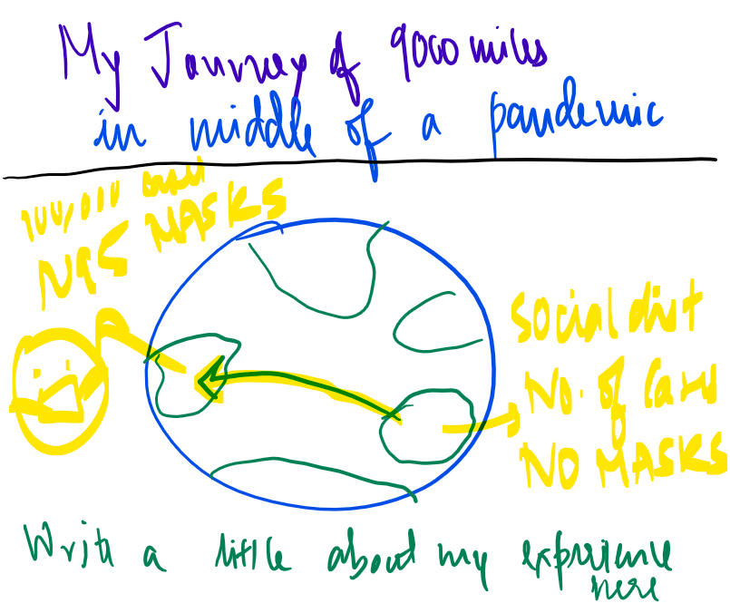
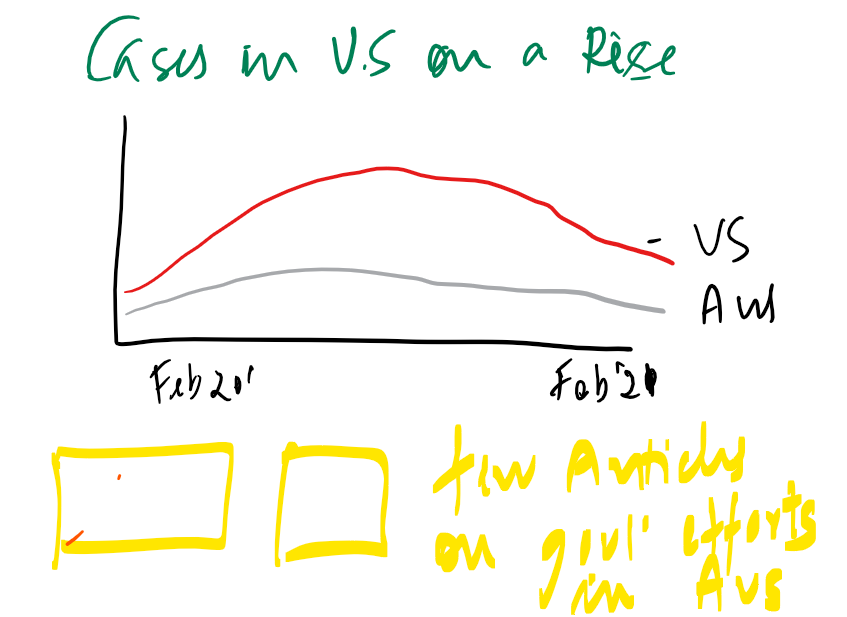
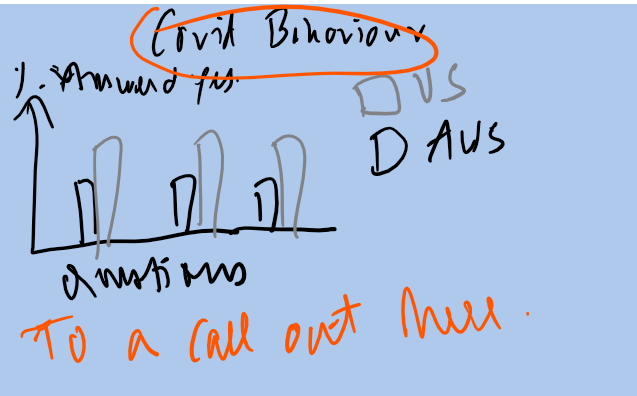
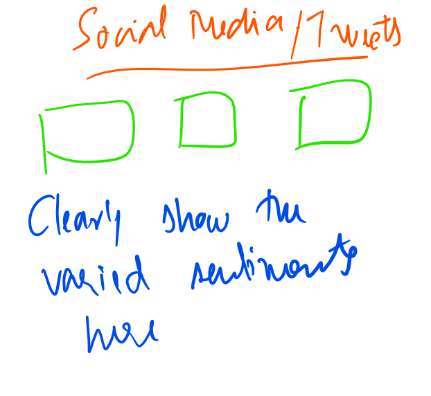

# Part I 

# 1. Outline

### "Covid Behaviour Shift: Australia vs USA "

## Summary :
For my final project, I have taken inspiration from my experience of shifting countries (Australia to US) in middle of the global pandemic - Covid 19. I observed differences in 
the response and behaviour of the people of the two countries towards the fight against Covid. I wish to convey the intensity of this difference to my audience by visualising and presenting data collected from reliable sources and surveys.

## Project Structure Overview :
- Looking start with my story and inspiration for this project
- Talk about observations and some instances from my personal experience 
- Show and compare the current covid trends in both the countries
- Maybe show a few extracts of the governement efforts like Australia has closed it's border since last year and also the statements related to Covid from the two country leaders
- Use Data Vizulation to showcase the differences in Covid Behaviour and Sentiments using the data sources to drive audience attention and interest in the topic
- Finally Call to action: Possibles steps the U.S Govt can take and learn from Australia

# 2. Initial Sketches

## 1

## 2

## 3

## 4

# 3. Data Sources
I am planning to use the following data source to help me convey the covid behaviour differences in the two countries. It contains around 100+ survey questions like "Would you self isolate if you had symptoms" and their average response recorded for each country

https://github.com/YouGov-Data/covid-19-tracker
  
  
# 4. Method and Medium

I plan on using Shorthand to create and present my work. I will be using Tableau and Flourish to create data visualizations
  
 [Click to return to my portfolio](/README.md)
