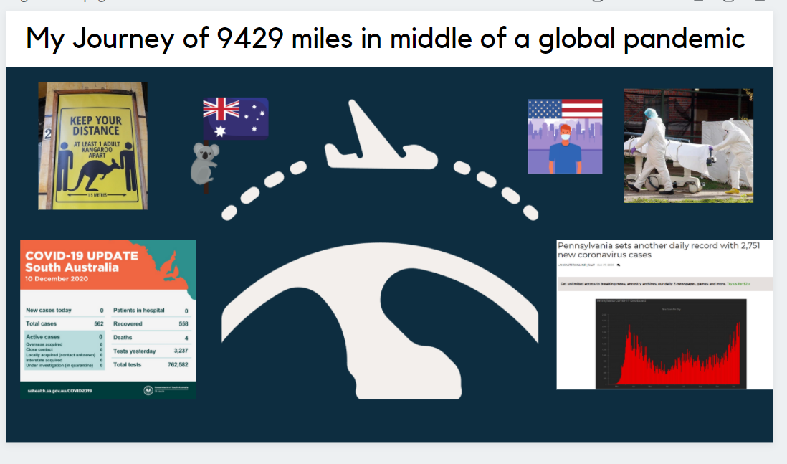
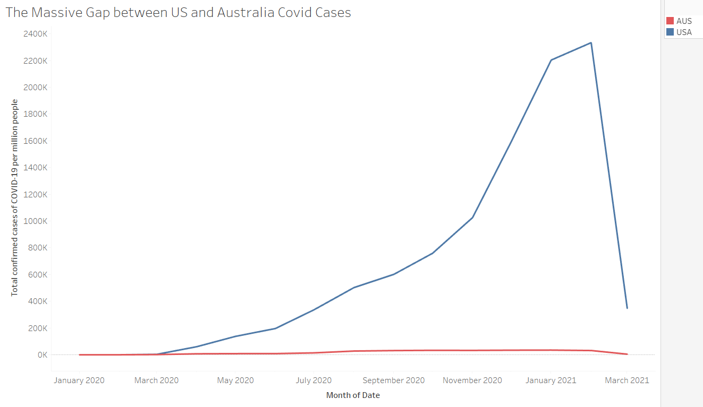
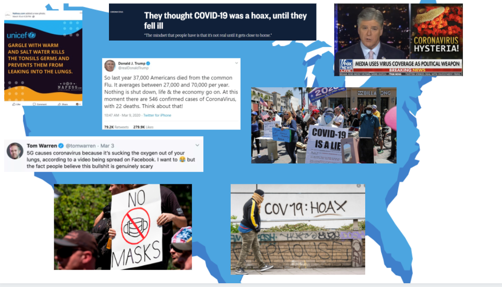
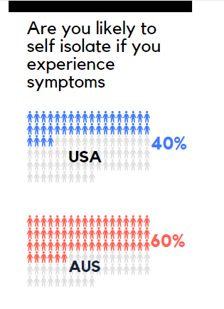

# Part II 

## Wirefames / storyboard for user feedback

**1. Introduction Page**

**2. Visualization to show the difference between the number of cases over time**

**3. American reaction to Corovirus as Hoax**

**4.  Covid Behavior Surevy results example (will have more question across pages)**

## User Research Protocol

## Target Audience
The target audience for my story are all Americans, young and old. The purpose of this project is to raise awareness about differences in Covid behavior between U.S and Australia and how this correlates to the number of cases and spread of virus in the two countries. 
Also allowing people to take insipiration from Australia to help convince them hifting their behavior in helping this fight against the Coronavirus pandemic

### Interview Script

#### Introduction : 

Hi, I'd like your help in refining my website, I have drawn some initial wireframes and have arranged them in the order they would appear in my final project. These include some visualizations as well as text. I seek honest feedback from you in order to refine these. The final wireframes will form the basis for my website and hence need to be really effective. Please take a look at the wireframes before we can begin this interview.

**1. Could you summarize the intent of the story for me in about a sentence or two?**

**2. Was there any part in the story where you felt a disconnect from the rest?**

**3. Is there some information, you thought, was lacking? If so what would you have liked to see?**

**4. How are the visualizations? Are they clear and persuading?**

**5. What was the call to action and does that resonate with you?**

**6. On a scale of 1 to 5 how would you rank the effectiveness of this story?**

I interviewed 3 individuals - a college student, my aunt and a cousin.

The feedback I received was that everyone was able to summarize the intent correctly, but they felt the storyline was a bit off. 
The visualizations were greatly appreciated, specially the info graphics one. 
On the title page I received a feedback, asking to use similar graphics for Adelaide and Pittsburgh covid stats 
When asked on call to action I received varied responses, basically felt that people weren't clear on it.

### Plan on implementating the following changes

1. Make the title page clearer; increase the font and find covid stats for Adelaide and Pittsburgh in same time frame and format
2. Elaborate the call to action further, with convincing graphics
3. Add additional elements to story to have a smooth flow and easy for audience to follow along

[Click to return to my portfolio](/README.md)
